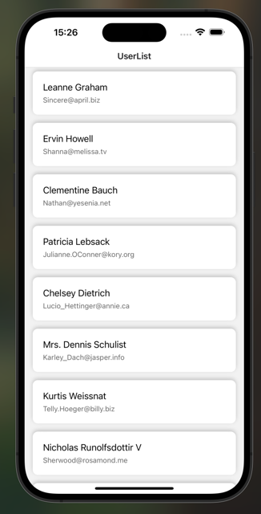
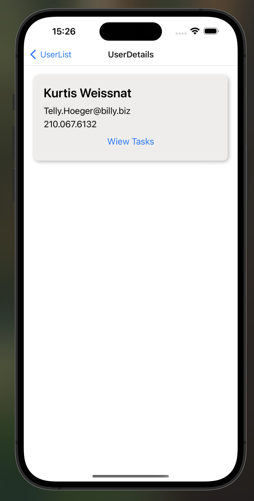
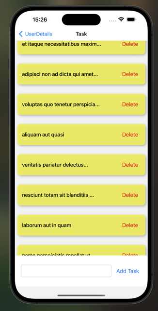

# Task Management App Using CONTEXT-API
A simple task management application built using React and Context API for state management.
## Screenshots 🖼️

### Video GIF


### UserListScreen



### UserDetailScreen



### TaskScreen




## Features
- Display a list of tasks with a user-friendly interface.
- Add new tasks dynamically using the addTask function.
- Delete existing tasks with the deleteTask function.
- Global state management with Context API for efficient data handling.

Technologies Used
- React: Frontend library for building the user interface.
- Context API: For managing the application's global state.
- React Native Navigation : For page navigation.

## Installation

Follow these steps to run the project locally:

1. Clone the repository:

```
git clone https://github.com/ozerbaykal/context-api.git
cd context-api

```

2. Install dependencies:

```
npm install

```

3. Run the app on a device or emulator:

- For Android:

```
npx react-native run-android


```

- For İOS:

```
npx react-native run-ios

```
4. Start the development serve
```
npm start
```

## Contributing

Contributions are welcome! Please open an issue first to discuss what you would like to change.

- 1.Fork the project
- 2.Create your feature branch (git checkout -b feature/NewFeature)
- 3.Commit your changes (git commit -m 'Add new feature')
- 4.Push to the branch (git push origin feature/NewFeature)
- 5.Open a Pull Request

## Contact 📬

**Özer BAYKAL**  
Email: [baykalozer87@gmail.com](mailto:baykalozer87@gmail.com)  
Project Link: [Movie App on GitHub](https://github.com/ozerbaykal/context-api)